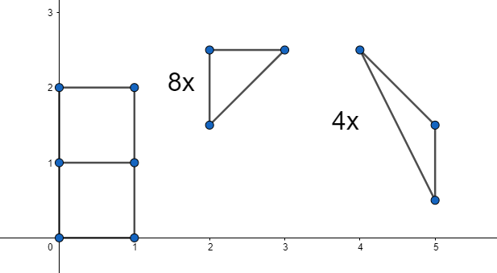
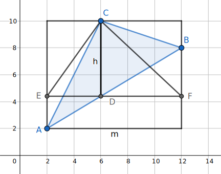
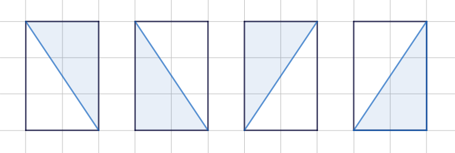
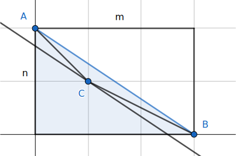

```{=html}
<!DOCTYPE html>
<html>

<head>
    <title>Counting empty triangles with number theory -- dramforever</title>
    <meta charset="utf-8">
    <meta name="viewport" content="width=device-width, initial-scale=1">
    <link rel="stylesheet" href="../../styles/default.css">
    <link rel="stylesheet" href="../../styles/post.css">
    <script type="text/javascript" async src="//cdn.mathjax.org/mathjax/latest/MathJax.js?config=TeX-MML-AM_CHTML"></script>
</head>

<body>

<div id="site-title">
    <h1 id="site-title-main"><a href="/">
        dramforever
    </a></h1>
    <div id="site-title-sub">coding, thoughts and stuff irl</div>
</div>

<article>
<div id="post-title">
    <h1 id="post-title-main">Counting empty triangles with number theory</h1>
    <span id="post-title-sub">2020-05-31</span>
</div>
```

*This is a writeup of the Codewars kata ['Count Empty Triangles in the Future'][triangle-kata]. You can see [the solution code I submitted][solution-code] if you solve it in C++ (or forfeit&hellip;).*

[triangle-kata]: https://www.codewars.com/kata/count-empty-triangles-in-the-future/
[solution-code]: https://www.codewars.com/kata/reviews/5c77022ab9e5260001c6eaee/groups/5ed20453b5d4a00001e0270d

## The problem statement

On a grid with width $m$ and height $n$, how many triangles have lattice points as vertices but otherwise have no lattice points on the edges and interiors? (Such triangles are called 'empty'.) Find the answer modulo $10^9 + 7$.

For example, for $m = 1$ and $n = 2$, the $12$ empty triangles by shape and multiplicity are given below: (Image from kata description.)

{ width=90% }

## Geometry part

According to [Pick's theorem][pick], a triangle with lattice point vertices has area:
$$
A =i + \frac{e}{2} + \frac{1}{2}
$$
Where $i$ is the number of lattice points on the interior (not counting edges), and $e$ is the number of points on the edges (not counting vertices). Therefore triangle is empty iff its area is $1/2$ and its vertices are lattice points. (For the sake of brevity we always work with lattice points from now on.)

Intuitively, empty triangles have a relatively 'thin' shape. The longer edges get, the 'thinner' the triangle gets. An exact useful bound in the 'thickness' of an empty triangle be encapsulated in this lemma:

[pick]: https://en.wikipedia.org/wiki/Pick%27s_theorem

**Lemma**: For an empty triangle, two of its vertices coincide with opposite corners of its bounding box.

*Proof*: Pick the leftmost point $A$ and rightmost point $B$ of a triangle. (If there is a tie, pick an arbitrary one.)

{ width=80% }

Without loss of generality, we assume that $B$ is higher than or level with $A$, and $C$ is above the line segment $AB$. Construct a vertical line through $C$, intersecting $AB$ at $D$ as shown. Let $h = \left|CD\right|$ and let $m$ be the horizontal distance between $A$ and $B$. Then the area of $\triangle ABC$ is $hm/2$. This can be shown by constructing a horizontal line through $D$ intersecting the bounding box on the side of $A$ at $E$, and on the side of $B$ at $F$, then  $\triangle CDE = \triangle CDA$ and $\triangle CDF = \triangle CDB$. Then:

$$
\begin{split}
\triangle ABC &= \triangle CDA + \triangle CDB \\
&= \triangle CDE + \triangle CDF \\
&= \triangle CEF \\
&= hm/2
\end{split}
$$

(Where clear from context $\triangle XYZ$ represents the triangle's area)

Therefore if $\triangle ABC$ is empty, then $hm = 1$. If $C$ is within the rectangle with $A$ and $B$ as corners (including boundaries), then it satisfies the desired conclusion.

Otherwise $C$ is above $B$, and since they are lattice points, $C$ must be at least $1$ unit higher than $B$, therefore $h \ge 1$. But we already have $m \ge 1$, so it must be the case that $h = m = 1$. Then one of $CA$ and $CB$ is vertical.

- If $CA$ is vertical, then $\left|CA\right| = h = 1$. We are now constrained in a $1 \times 1$ box, in which the only possible triangle shape of edge lengths $(1, 1, \sqrt{2})$ indeed has two vertices as corners of its bounding box.
- If $CB$ is vertical, then $A$ and $C$ are corners of the bounding box of $\triangle ABC$

Thus concludes the proof of this lemma.

Now we only need to find, for each possible bounding box size, the number of empty triangles that fits exactly into this bounding box. There are four completely symmetric ways to fit an empty triangle into its, depending which diagonal the triangle's two points 'outer' points sit on, and on which side the third 'inner' point lies. Here's the four cases illustrated, where in each case the shown diagonal is one edge of the triangle, and the other vertex is in the shaded region.

{ width=90% }

Therefore we can just calculate one case and multiply the answer by four. Let's put one case at the origin like this:

{ width=70% }

Supposed the rectangle has width $m$ and height $n$. Similar to what has been shown while proving the lemma, for the area of $\triangle ABC$ to be $1/2$, $C$ must lie on a line that is $AB$ shifted down by $1/m$, and it must also be a lattice point. The equation of line $AB$ is:
$$
\frac{x}{m} + \frac{y}{n} = 1
$$
And therefore that of the shifted line is:
$$
\begin{align}
\frac{x}{m} + \frac{y + 1/m}{n} &= 1 \\
nx + my + 1 &= mn \\
m(n - y) + n(- x) &= 1
\end{align}
$$
[Bézout's identity][bezout]  tells us that there are solutions if and only if $\gcd(m, n) = 1$. We are interested in only solutions in the region $0 \le x < m$ and $0 \le y < n$. Given one solution $(x=x_{0},y=y_{0})$, the general solution is $(x = x_0 + km,y = y_0 - kn)$ where $k$ is any integer. There is a unique solution $(x = x_0 + \lfloor y_0 / n \rfloor m, y = y_0 \bmod n)$ that lies within the region. This can be shown first by noting that euclidean division of integers gives a unique $0 \le y < n$ such that for some integer $k$, $y_0 = kn+y$. Then we verify that $x \ge 0$, which shows that the solution is inside the region we want:

[bezout]: https://en.wikipedia.org/wiki/B%C3%A9zout%27s_identity

$$
\begin{split}
x &= x_0 + \lfloor \frac{y_0}{n} \rfloor m \\
&= \frac{m(n - y_0) - 1}{n} + \lfloor \frac{y_0}{n} \rfloor m \\
&= m(1 + \lfloor \frac{y_0}{n} \rfloor - \frac{y_0}{n}) - \frac{1}{n} \\
&\ge m \cdot \frac{1}{n} - \frac{1}{n} \\
&= \frac{m - 1}{n} \\
&\ge 0
\end{split}
$$
(In the middle inequality step, note that since $y_0$ is a integer, $y_0 / n$ is some integer plus $k / n$, where $k$ is a integer such that $0 \le k < n$.)

Therefore an $m \times n$ bounding box has four empty triangles if $\gcd(m, n) = 1$, and none otherwise.

We however need to consider all bounding box sizes from $1 \times 1$ up to $m \times n$, instead of just one size. A size $j \times i$ rectangle fits into a size $m \times n$ rectangle $(n + 1 - i)(m + 1 - j)$ times. So the answer is:
$$
4\sum_{i = 1}^{n} \sum_{j = 1}^{m}
	[\gcd(i, j) = 1] (n + 1 - i) (m + 1 - j)
$$

($[P]$ is the [Iverson bracket][iverson-bracket], which is $1$ when $P$ is true and $0$ otherwise.)

[iverson-bracket]: https://en.wikipedia.org/wiki/Iverson_bracket

(Note 1: I'm doing this weird transposition of coordinate thing (just once here) because we don't use coordinates consistently between geometry and, shall we say, discrete mathematics. In geometry to refer to a point we have $x$ before $y$, and $y$ positive goes up, but if we refer to an entry in a matrix we have row number before column number, and successive rows goes down. Things are completely symmetric anyway, so the best way to deal with this inconsistency is to forget that you noticed it or that I told you it.)

(Note 2: This function without the factor $4$ can be found as [A114999][a114999] on OEIS.)

[a114999]: http://oeis.org/A114999

**Current progress**: We know that we need to find $4 \times a(n, m)$ where
$$
a(n, m) = \sum_{i = 1}^{n} \sum_{j = 1}^{m}
	[\gcd(i, j) = 1] (n + 1 - i) (m + 1 - j)
$$

## Number theory part

$$
\begin{split}
a(n, m) &= \sum_{i = 1}^{n} \sum_{j = 1}^{m}
	[\gcd(i, j) = 1] (n + 1 - i) (m + 1 - j) \\
&= \sum_{i = 1}^{n} \sum_{j = 1}^{m}
	[\gcd(i, j) = 1] ((n + 1) (m + 1) - (m + 1) i - (n + 1) j + ij) \\
\end{split}
$$

[Möbius inversion][mobius] is an application of the inclusion-exclusion principle. A function is defined as follows:

[mobius]: https://en.wikipedia.org/wiki/Möbius_inversion

$$
\mu(n) = \begin{cases}
(-1)^{k} & \text{if $n$ factorizes to $k$ distinct primes} \\
0 & \text{otherwise}
\end{cases}
$$
This function has this important property:
$$
\sum_{d | n} \mu(d)=[n=1]
$$
(Where $d|n$ means for each positive divisor of $n$ including $1$ and $n$, of course not counting twice if $n$ is $1$.)

We can use this equation to replace $[\gcd(i, j) = 1]$ with $\sum_{d|\!\gcd(i, j)} \mu(d)$, which allows us to 'unleash' the properties of $\gcd(i, j)$, namely that the set of divisors of $\gcd(i, j)$ is the set of common divisors of $i$ and $j$ (which I write as summing over $d | i, d | j$ below), which in turn allows us to rewrite out summations:
$$
\begin{split}
\cdots &= \sum_{i = 1}^{n}
	\sum_{j = 1}^{m}
	\sum_{d | \!\gcd(i, j)}
	\mu(d) ((n + 1) (m + 1) - (m + 1) i - (n + 1) j + ij) \\
&= \sum_{i = 1}^{n}
	\sum_{j = 1}^{m}
	\sum_{d | i, d | j}
	\mu(d) ((n + 1) (m + 1) - (m + 1) i - (n + 1) j + ij) \\
&= \sum_{d = 1}^{\min\{n, m\}}
	\sum_{i = 1}^{\lfloor n / d \rfloor}
	\sum_{j = 1}^{\lfloor m / d \rfloor}
	\mu(d) ((n + 1) (m + 1) - (m + 1) di - (n + 1) dj + d^2ij) \\
\end{split}
$$

Note that in the last step I 'switched variables' $i \leftarrow i/d$ and $j \leftarrow j/d$, and instead of looking for possible $d$ given $i$ and $j$, I look for possible $di$ and $dj$ given $d$, which is simpler because it does not involve a divisibility check.

Let's split that up into three parts for easier handling later on:
$$
\cdots = a_0(n, m) + a_1(n, m) + a_2(n, m)
$$
Where:
$$
\begin{align}
a_0(n, m) &= \sum_{d = 1}^{\min\{n, m\}}
	\mu(d)
	(n + 1) (m + 1)
	\lfloor \frac{n}{d} \rfloor
	\lfloor \frac{m}{d} \rfloor \\

a_1(n, m) &= \sum_{d = 1}^{\min\{n, m\}}
	\mu(d) d
	\left(
	-
		(m + 1)
		\mathsf{ID}(\lfloor \frac{n}{d} \rfloor)
		\lfloor \frac{m}{d} \rfloor
	-
		(n + 1)
		\mathsf{ID}(\lfloor \frac{m}{d} \rfloor)
		\lfloor \frac{n}{d} \rfloor
	\right) \\

a_2(n, m) &= \sum_{d = 1}^{\min\{n, m\}}
	\mu(d) d^2
	\mathsf{ID}(\lfloor \frac{n}{d} \rfloor)
	\mathsf{ID}(\lfloor \frac{m}{d} \rfloor)
\end{align}
$$

Where $\mathsf{ID}(n)$ is the sum of $\mathsf{id}(n) = n$, that is $\mathsf{ID}(n) = n (n + 1) / 2$.

The three parts have a common pattern:
$$
\begin{align}
s_{k, u}(n, m) &= \sum_{d = 1}^{\min\{n, m\}}
	\mu(d) d^k
	u(\lfloor \frac{n}{d} \rfloor, \lfloor \frac{m}{d} \rfloor)
\end{align}
$$
Where $f$ is trivially computable. If we figure out how to compute that, we're set.

## Intermission: Number-theoretic summation trick

Now for something completely out of nowhere.

The Dirichlet convolution of two functions is defined as:
$$
(f * g)(n) = \sum_{d | n} f(d) g(\frac{n}{d})
$$
Let $G(n) = \sum_{i = 1}^{n} g(i)$, and similarly let capital letter functions represent the sum of the corresponding lowercase letter functions. An observation is that if we sum a Dirichlet convolution, we get: (The sum over $cd = i$ means all positive integers $c$ and $d$ such that $cd = i$, and the sum over $cd \le n$ works similarly)
$$
\begin{split}
\sum_{i = 1}^{n} (f * g)(i) &= \sum_{i = 1}^{n} \sum_{d | i} f(d) g(\frac{i}{d}) \\
&= \sum_{i = 1}^{n} \sum_{cd = i} f(c) g(d) \\
&= \sum_{cd \le n} f(c) g(d) \\
&= \sum_{c = 1}^{n} f(c) \sum_{i = 1}^{\lfloor n / c \rfloor} g(i) \\
&= \sum_{c = 1}^{n} f(c) G(\lfloor \frac{n}{c} \rfloor)
\end{split}
$$
Isolating the first term gives:
$$
f(1) G(n) = \sum_{i = 1}^{n} (f * g)(i) - \sum_{c = 1}^{n} f(c) G(\lfloor \frac{n}{c} \rfloor)
$$
If $f(1) \ne$ 0, then:
$$
G(n) = \frac{1}{f(1)} \left(\sum_{i = 1}^{n} (f * g)(i) - \sum_{c = 1}^{n} f(c) G(\lfloor \frac{n}{c} \rfloor) \right)
$$
Assume for now that $f$ is chosen such that $F(i)$ and $\sum_{i = 1}^{n} (f * g)(i)$ are efficiently computable, either directly via an $O(1)$ formula or indirectly via a 'recursive' application of this technique.

Note that $\lfloor n / c \rfloor$ can only take on a maximum of about $2 \sqrt{n}$ values:

- $n/1, n/2,\dots,n/\sqrt{n}$ (final term is approximate), for $c \le \sqrt{n}$
- about $\sqrt{n}, \sqrt{n} - 1, \dots, 1$, for $c > \sqrt{n}$

The sum over $c$ from $1$ to $n$ is now broken up into $O(\sqrt{n})$ segments where $\lfloor n / c \rfloor$ is equal, and $G(\lfloor n / c \rfloor)$ only needs to be calculated once per segment.

Given $x$, we want to solve for $j$ in $\lfloor n / j \rfloor = x$, which shall give us the form of each segment.
$$
\begin{gather}
x = \lfloor \frac{n}{j} \rfloor \\

x \le \frac{n}{j} < x + 1 \\
\frac{n}{x+1} < j \le \frac{n}{x} \\

\left\lfloor \frac{n}{x+1} \right\rfloor + 1
\le j
\le \left\lfloor \frac{n}{x} \right\rfloor

\end{gather}
$$
Therefore given the the first interval's starting point $l_{1} = 2$, the end of this interval is $r_{1} = \lfloor n / \lfloor n / 2 \rfloor \rfloor$, and then the next interval starts at $l_{2} = r_{1} + 1$ and ends at $r_2 = \lfloor n / \lfloor n / l_{2} \rfloor \rfloor$, etc until $n$ is reached. In each interval $[l_i, r_i]$ the sum is $(F(r_i) - F(l_i)) G(\lfloor n / l_i \rfloor)$.

By recursively computing $G$ as shown, memoizing using a hash table, we can achieve $O(n^{3/4})$ time complexity and $O(n^{1/2})$ space complexity. If we use a sieve to pre-compute the first $O(n^{2/3})$ terms of $G(n)$ we can achieve $O(n^{2/3})$ time and space complexity.

The complexity proof: In the no-precomputation case every $G(\lfloor n / d \rfloor)$ is computed exactly once, each taking $O(\sqrt{\lfloor n / d \rfloor})$ time. As discussed earlier $\lfloor n / d \rfloor$ takes on the values $1, 2, \dots, \sqrt{n}$ and $n/1, n/2, ..., n/\sqrt{n}$ (We are talking asymptotics here so we'll just ignore the details.), therefore the total time is:
$$
\begin{align}
T(n) &= \sum_{i = 1}^{\sqrt{n}} O\left( \sqrt{i} + \sqrt{\frac{n}{i}} \right) \\
&= \sum_{i = 1}^{\sqrt{n}} O\left( i^{1/2} + i^{-1/2} \sqrt{n} \right) \\
&= O((\sqrt{n})^{3/2}) + O((\sqrt{n})^{1/2}) \sqrt{n} \\
&= O(n^{3/4})
\end{align}
$$
If we can find the first $O(n^k)$ (where $1/2 \le k \le 3/4$) values of $g$ in $O(n^k)$ time we can accelerate the process. This is often possible for, for example, multiplicative functions where [Euler's sieve][wp-euler-sieve] can be used. For more detailed information check [this note on Codeforces][cf-euler-sieve]. The new execution time is

[wp-euler-sieve]: https://en.wikipedia.org/wiki/Sieve_of_Eratosthenes#Euler's_sieve
[cf-euler-sieve]: https://codeforces.com/blog/entry/54090

$$
\begin{align}
T'_k(n) &= O(n^k) + \sum_{i = 1}^{n^{1 - k}} O(\sqrt{\frac{n}{i}}) \\
&= O(n^k + n^{(1 - k) / 2} \sqrt{n}) \\
&= O(n^k + n^{(2 - k) / 2})
\end{align}
$$

Asymptotically, $T'_k(n)$ is minimized when $k = (2 - k) / 2$, which is $k = 2/3$. In practice, the number of values to precompute is a tunable that will be set according to needs.

To summarize, this means that if $h = f * g$, and $H$ and $F$ can be computed efficiently either directly or 'recursively' by this technique, then $G$ can be computed efficiently.

I could not find any authoritative reference on this method. The best I could find is this [answer on math.SE][mse-summation].

[mse-summation]: https://math.stackexchange.com/a/1740370

The algorithm described above is often shown as a method to compute isolated values of $G(n)$, but it actually computes $G(\lfloor n / d \rfloor)$ for all possible values of $\lfloor n / d \rfloor$. This will become handy if, as alluded to earlier, $F(n)$ is still non-trivial but this method can apply, but we won't need this for now. We shall see how this helps us here in a minute, but first we need to find $f$ and $h$.

## Back to business

In the definition of $s_{k,f}$, we extract the 'difficult' part $\mu(n) n^{k}$ and we can define another function along with it:
$$
\begin{align}m_k(n) &= \mu(n) n^k \\\mathsf{id}^k(n) &= n^k\end{align}
$$
The Dirichlet convolution of the two is:
$$
\begin{align}(m_{k} * \mathsf{id}^{k})(n) &= \sum_{d|n} \mu(d) d^k (\frac{n}{d})^k \\&= \sum_{d|n} \mu(d) n^k \\&= (\sum_{d|n} \mu(d)) n^k \\&= [n = 1] n^k \\&= [n = 1]\end{align}
$$
That's quite simple. This is no surprise, since $[n = 1]$ is the identity of Dirichlet convolution, and $m_{k}$ is the Dirichlet inverse of $\mathsf{id}^{k}$. Refer to [Wikipedia][dirichlet-inverse] for details.

[dirichlet-inverse]: https://en.wikipedia.org/wiki/Dirichlet_convolution#Other_formulas

Can we use the earlier technique to compute sums of $m_k(n) = \mu(n) n^k$? The answer is yes, as the sum of the functions involved are either trivial or well-known:
$$
\begin{align}
\sum_{i = 1}^{n} [i = 1] &= 1 \\
\sum_{i = 1}^{n} 1 &= n \\
\sum_{i = 1}^{n} i &= \frac{i (i + 1)}{2} \\
\sum_{i = 1}^{n} i^2 &= \frac{i (i + 1) (2i + 1)}{6} \\
\end{align}
$$
Therefore it is possible to compute $M_k(\lfloor n / d \rfloor)$ for all possible values of $\lfloor n / d \rfloor$ in $O(n^{3/4})$ time. (Remember that uppercase means sum.)

Can we use the faster $O(n^{2/3})$ method? The answer is yes because $m_k$ is multiplicative. I'll refer to the [notes on Euler's sieve][cf-euler-sieve] mentioned earlier.

Remind you, we want to compute this.
$$
\begin{align}
s_{k, u}(n, m) &= \sum_{d = 1}^{\min\{n, m\}}
	m_k(d)
	u(\lfloor \frac{n}{d} \rfloor, \lfloor \frac{m}{d} \rfloor)
\end{align}
$$
This is eerily familiar. In fact this is almost what we did in the intermission. But now $f$ takes two arguments.

How many values can the pair $(\lfloor n / d \rfloor, \lfloor m / d \rfloor)$ take on? As $d$ increases, $\lfloor n / d \rfloor$ decreases, and it will take about $2 \sqrt{n}$ steps doing so, and similarly for $\lfloor n / d \rfloor$, therefore $(\lfloor n / d \rfloor, \lfloor m / d \rfloor)$ takes on about $2 (\sqrt{n} + \sqrt{m})$ steps. For example for $n = 10$ and $m = 3$, the combined steps like this (open the image in a new tab if it's too small for you):

{ width=90% }

Apply the exact same strategy as before: For the first interval, the start is $l_1 = 1$, and end is $r_1 = \min\{\lfloor n / \lfloor n / l_1 \rfloor \rfloor, \lfloor m / \lfloor m / l_1 \rfloor \rfloor\}$, then for the second interval $l_2 = r_1 + 1$ and $r_2 = \min\{\lfloor n / \lfloor n / l_2 \rfloor \rfloor, \lfloor m / \lfloor m / l_2 \rfloor \rfloor\}$ and so on until $\min\{n, m\}$. The sum in each interval is then $(M_k(r_i) - M_k(l_i - 1))f(\lfloor n / l_i \rfloor, \lfloor m / l_i \rfloor)$.

We can see that each $r_i$ and $l_i - 1$ is either of the form $\lfloor n / d \rfloor$ or $\lfloor m / d \rfloor$ or $0$. For the algorithm to work, $M_k(0)$ should be the natural choice of sum of no numbers, $0$. Therefore if we compute all $M_k(\lfloor n / d \rfloor)$ and $M_k(\lfloor m / d \rfloor)$ in $O(\max\{n, m\}^{2/3})$ time, we can use $O(\sqrt{n})$ time to combine them into our answer $s_{k, f}(n, m)$ (provided that $f$ is available in $O(1)$, which is the case.)

Applying this template to the three parts of the sum, which as a reminder are:
$$
\begin{align}
a_0(n, m) &= \sum_{d = 1}^{\min\{n, m\}}
	\mu(d)
	(n + 1) (m + 1)
	\lfloor \frac{n}{d} \rfloor
	\lfloor \frac{m}{d} \rfloor \\

a_1(n, m) &= \sum_{d = 1}^{\min\{n, m\}}
	\mu(d) d
	\left(
	-
		(m + 1)
		\mathsf{ID}(\lfloor \frac{n}{d} \rfloor)
		\lfloor \frac{m}{d} \rfloor
	-
		(n + 1)
		\mathsf{ID}(\lfloor \frac{m}{d} \rfloor)
		\lfloor \frac{n}{d} \rfloor
	\right) \\

a_2(n, m) &= \sum_{d = 1}^{\min\{n, m\}}
	\mu(d) d^2
	\mathsf{ID}(\lfloor \frac{n}{d} \rfloor)
	\mathsf{ID}(\lfloor \frac{m}{d} \rfloor)
\end{align}
$$
We can have our answer $4 (a_0(n, m) + a_1(n, m) + a_2(n, m))$ in $O(\min\{n, m\}^{2/3})$ time and $O(\min\{n, m\}^{2/3})$ space.

Phew, that was a whopping three thousand words according to Typora. Admittedly though it does count words in LaTeX code, which may or may not represent the effort needed to read math notation.

## A few more details

The problem requires modulo arithmetic, otherwise word-sized integers won't hold such large numbers. A supporting class `mo` is used for this purpose. I worried that it would hinder optimization, but casually playing around on <https://godbolt.org> shows that it works exactly the same as using functions while not wrapping the number in a class.

Since this method requires calculating three things at once, I wrote this tiny function that 'vectorizes' a function to multiple `std::array` 'vectors'. It comes into play quite a few times in my code and cleans up the code quite a bit. It seems to optimize well, with the loop unrolled and function properly inlined at least when tested under recent Clang. Quite a bit of what I learned while solving this kata is actually for writing this.

```c++
template<typename Func, size_t N, typename... Args>
decltype(auto) arrf(Func f, std::array<Args, N>... args) {
    std::array<decltype(f(args[0]...)), N> res;
    for (size_t i = 0; i != res.size(); i ++) {
        res[i] = f(args[i]...);
    }
    return res;
}
```

I also took the opportunity to enjoy many post-C++11 features such as initializer lists, `std::optional`, `std::array`, `std::unordered_map`, parameter packs `typename... Args`, and maybe some others I've missed. I did not get to use these features when I used to do competitive programming a few years ago because of the poor adoption of up-to-date compilers. It's a nice refresher doing these things at a slightly higher level of abstraction while sacrificing little to no efficiency, in a modernized language that is admittedly quite old but also more alive than ever.

## About this document

The source of this document can be found at [`empty-triangles.md`](empty-triangles.md). Generate this HTML page with:

```console
$ pandoc --mathjax -f markdown-smart < empty-triangles.md > index.html
```

```{=html}
</body>
</html>
```
